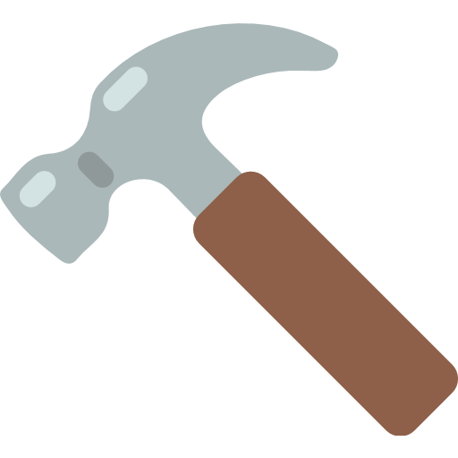

# Supply List

This is my Level 2 NCEA project for Digital Technologies

It is a database-connected website that allows users to:

- Easily remove and add tools
- Edit info about stock
- Able to view all the tools
- Make a list of needed items
- Move lists from needed and have

## Documentation

The following documents support this project:

- [Design & Review](Design.md)
- [Development & Testing](Development.md)

