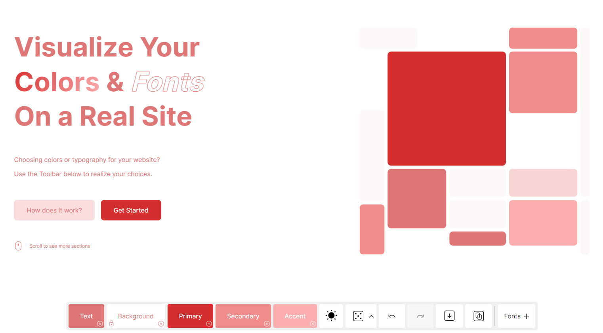

# Development of a Database-Linked Website for NCEA Level 2

Project Name: **Supply List**

Project Author: **Azaria Lee**

Assessment Standards: **91892** and **91893**

-------------------------------------------------

## Design, Development and Testing Log

### 28/05/2024

Flow chart showing how to navigate the app

I have made a little chart in Excalidraw to show how to navigate around the app, the arrow shows every possible action you can take and points to the screen you'd go to if you did it.

### 30/05/2024 - 10/06/2024

Designing the app

I have made a wireframe, with no colour, of what the mobile app may look like before talking to my end user. The blue arrows indicate if you click where it starts, it will take you to a specific page/where the arrow is pointing. The the following screenshot shows without the navigation to have a better viewing.

When talking with my end user they gave me feedback
> It's good but I think on the needed stock page should have 2 checklists, one for stuff that has been ordered then another for arrived as well as a delete button on the home page to delete items

### 13/06/2024

I used the end users feedback to add the features they thought would be more helpful

They thought to add a delete feature on the home page so it is more efficient to delete stuff from the home page and added the 2 checklists on needed stock, the idea is so the end user can keep track of stuff that is on the way and then once they arrived they caan tick that box and it will move back to the home page

### 13/06/2024

Moving some stuff around + added new page

I decided to add an extra page if the end user were to delete something a new page would appear asking if the end user is sure they want this to be done to avoid them accidentally clicking it. And then also moved "view needed" to the top in the nav bar for easier access.

### 10/06/2024

I have started thinking up a colour scheme to use, here is the link to realtime colours, the website that shows how the colours look in real time on the website.

https://www.realtimecolors.com/?colors=df7676-ffffff-d52e2e-f08c8c-fcadae&fonts=Inter-Inter

I have used a brighter red so it is easy to notice, along with a white background, as for my end user prefers the light mode instead of dark mode on websites and apps and all the colours alternate nicely so every colour is seeable.

When talking with my end user they gave me feedback
> I think the text should be a darker colour so it is easier to read

### 13/06/2024

Changed the text colour

I used my end users feedback and made the text a darker colour to contrast with the white background

https://www.realtimecolors.com/?colors=990606-ffffff-dc3030-f08c8c-fcadae&fonts=Inter-Inter

### 13/06/2024

Added colour

I tried creating the first design with colour, I am unsure about the pinks but I will talk to my end user about it, other than that the texts are easy to read because of the darker text colour and lighter bacground colours

### 22/072024

New sql

We had a rethink of the table and it has been redone to more focus on the location

